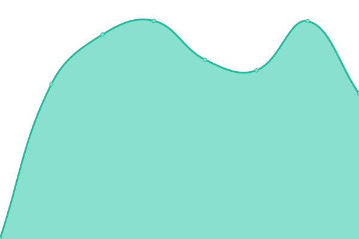

# [📈 Live Status](https://status.zolza-hairstyles.pl): <!--live status--> **🟩 All systems operational**

This repository contains the open-source uptime monitor and status page for [MePhew & GonteQ Industries](https://status.zolza-hairstyles.pl), powered by [Upptime](https://github.com/upptime/upptime).

With [Upptime](https://upptime.js.org), you can get your own unlimited and free uptime monitor and status page, powered entirely by a GitHub repository. We use [Issues](https://github.com/MePhew-GonteQ-Industries/zolza-hairstyles-uptime/issues) as incident reports, [Actions](https://github.com/MePhew-GonteQ-Industries/zolza-hairstyles-uptime/actions) as uptime monitors, and [Pages](https://status.zolza-hairstyles.pl) for the status page.

<!--start: status pages-->
<!-- This summary is generated by Upptime (https://github.com/upptime/upptime) -->
<!-- Do not edit this manually, your changes will be overwritten -->
<!-- prettier-ignore -->
| URL | Status | History | Response Time | Uptime |
| --- | ------ | ------- | ------------- | ------ |
|  [Zołza Hairstyles](https://zolza-hairstyles.pl) | 🟩 Up | [zolza-hairstyles.yml](https://github.com/MePhew-GonteQ-Industries/zolza-hairstyles-uptime/commits/HEAD/history/zolza-hairstyles.yml) | 

 400ms
     
 | 

<a href="https://MePhew-GonteQ-Industries.github.io/zolza-hairstyles-uptime/history/zolza-hairstyles">100.00%</a>
    

|  [API](https://api.zolza-hairstyles.pl/api/docs) | 🟩 Up | [api.yml](https://github.com/MePhew-GonteQ-Industries/zolza-hairstyles-uptime/commits/HEAD/history/api.yml) | 

 377ms
     
 | 

<a href="https://MePhew-GonteQ-Industries.github.io/zolza-hairstyles-uptime/history/api">92.28%</a>
    

<!--end: status pages-->

[**Visit our status website →**](https://mephew-gonteq-industries.github.io/zolza-hairstyles-uptime/)

## 📄 License

- Powered by: [Upptime](https://github.com/upptime/upptime)
- Code: [MIT](./LICENSE) © [MePhew & GonteQ Industries](https://status.zolza-hairstyles.pl)
- Data in the `./history` directory: [Open Database License](https://opendatacommons.org/licenses/odbl/1-0/)
